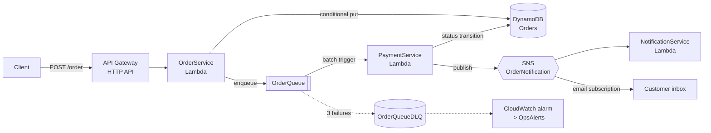

# Serverless Order Processing on AWS

An event-driven order intake and fulfilment pipeline built entirely on managed
AWS services — no servers, no containers, no idle cost. A customer places an
order over HTTPS; it is validated, persisted, queued, paid, and confirmed by
five services that never call each other directly.

[](https://github.com/YOUR_USERNAME/serverless-order-processing-aws/actions/workflows/ci.yml)
[](https://www.python.org/downloads/)
[](https://docs.aws.amazon.com/general/latest/gr/rande.html)
[](LICENSE)

> **This branch builds the system by hand in the AWS Console.** Every service is
> created click by click, so you can see what each one contributes before
> automating it. The [`iac-sam`](../../tree/iac-sam) branch deploys the identical
> architecture from a single AWS SAM template.

---

## The problem

Order intake and payment settlement have incompatible requirements.

Intake must be **fast and always available** — a customer tapping "Place order"
should get an answer in milliseconds, and an outage in a downstream system is no
excuse for rejecting their money. Settlement is the opposite: it depends on a
third-party payment gateway that is **slow, rate-limited, and occasionally
down**, and it must never charge the same card twice.

Putting them in one synchronous request forces a bad trade. The customer waits
on the gateway, a gateway timeout loses the order entirely, and a retry from a
flaky mobile connection creates a second order and a second charge.

## The approach

Split the two along a queue.



`OrderService` does only what has to happen before the customer gets a response:
validate, persist, enqueue. It returns `201`-style JSON in well under a second.
Everything expensive happens after, driven by the queue, where retries are free
and a gateway outage means a backlog rather than lost revenue.

### Request lifecycle

| # | Step | Guarantee it provides |
|---|---|---|
| 1 | Client `POST`s an order, optionally with an `Idempotency-Key` header | The client can retry safely |
| 2 | `OrderService` validates the payload | Malformed input gets `400` with per-field detail, never a `500` |
| 3 | Conditional `PutItem` on `attribute_not_exists(orderId)` | A retried request creates one order, not two |
| 4 | Message sent to `OrderQueue`, response returned | The customer is not waiting on the payment gateway |
| 5 | `PaymentService` consumes a batch of up to 10 | Throughput without per-message invocation overhead |
| 6 | Conditional `UpdateItem` guarded by `status = PLACED` | SQS's at-least-once delivery cannot charge twice |
| 7 | Result published to SNS | Notification channels are added without touching payment code |
| 8 | Failures returned as `batchItemFailures` | One bad message is retried, not the other nine |
| 9 | Three failures, then `OrderQueueDLQ` + alarm | Nothing is lost silently |

## Why these services

| Choice | Reasoning |
|---|---|
| **HTTP API** over REST API | Roughly a third of the cost and lower latency; the REST API's extra features (request models, usage plans) are not needed yet |
| **DynamoDB on-demand** | Single-key access by `orderId`, scales to zero between demos, no capacity planning |
| **SQS Standard** over FIFO | Ordering between different customers' orders is meaningless, and Standard gives far higher throughput. Idempotency is handled in code rather than bought from FIFO |
| **SNS** between payment and notification | Fan-out. Adding SMS, Slack, or a warehouse feed is a new subscriber, not a code change |
| **Lambda** over Fargate | Traffic is spiky and event-shaped; paying for an idle container makes no sense |

Full design detail, data model and failure matrix: **[docs/architecture.md](docs/architecture.md)**.

---

## Build it yourself

**[→ Console walkthrough](docs/console-walkthrough.md)** — ten steps from an
empty account to a working endpoint, in dependency order, with the IAM policies
written out and a troubleshooting table for each thing that commonly breaks.

**[→ Custom domain](docs/custom-domain.md)** — putting the API behind
`api.redsparrowenterprise.in` over HTTPS with ACM and Route 53.

**[→ Results and output analysis](docs/outputs.md)** — screenshots from the
live deployment, and what each one proves about the architecture.

An order placed over HTTPS, and the confirmation that arrives once payment
settles asynchronously — the whole pipeline in one frame:


## Repository layout

```
.
├── README.md                    # You are here
├── docs/
│   ├── architecture.md          # Design decisions, data model, failure matrix
│   ├── console-walkthrough.md   # Build the stack by hand, step by step
│   ├── custom-domain.md         # ACM + API Gateway + Route 53
│   ├── outputs.md               # Live results, screenshot by screenshot
│   └── production-readiness.md  # Gap analysis and roadmap
├── lambda_functions/
│   ├── order_service/app.py            # POST /order  — validate, persist, enqueue
│   ├── payment_service/app.py          # SQS consumer — settle, transition, publish
│   └── notification_service/app.py     # SNS subscriber — dispatch, record delivery
├── screenshots/                 # Console and terminal evidence
├── tests/
│   └── test_order_service.py    # Validation unit tests
└── .github/workflows/ci.yml     # Runs the test suite on every push
```

The SAM template lives on the [`iac-sam`](../../tree/iac-sam) branch, under
`infrastructure/`.

## Running the tests

```bash
git clone https://github.com/YOUR_USERNAME/serverless-order-processing-aws.git
cd serverless-order-processing-aws

pip install -r requirements-dev.txt
pytest -v
```

No AWS credentials needed — the suite covers `OrderService`'s validation logic,
which is pure. CI runs the same command on every push and pull request.

## Cost

Every component is on-demand and scales to zero. A demo handling a few hundred
requests sits inside the AWS Free Tier. The only things that bill while idle are
the CloudWatch log groups and DynamoDB point-in-time recovery — both pennies at
this size, and both removed by the teardown steps at the end of the walkthrough.

## Where this would go next

Authentication with Cognito, a real payment gateway behind Secrets Manager, and
a redrive runbook for the dead letter queue are the three things standing
between this and something that could take real orders. The reasoning for each,
and a full gap analysis, is in
**[docs/production-readiness.md](docs/production-readiness.md)**.

## License

[MIT](LICENSE)
