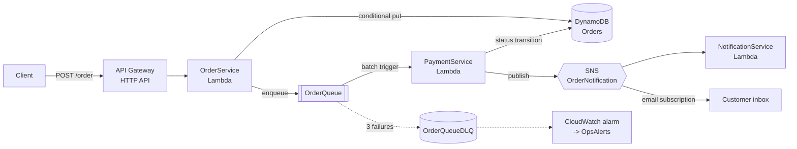
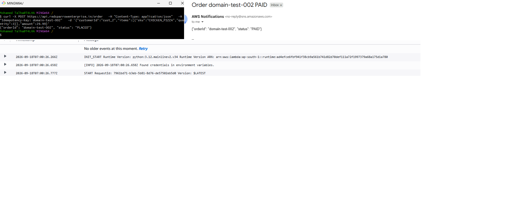

# Serverless Order Processing on AWS — Infrastructure as Code

An event-driven order intake and fulfilment pipeline built entirely on managed
AWS services, defined as a single AWS SAM template and deployed with one command.

[](https://github.com/YOUR_USERNAME/serverless-order-processing-aws/actions/workflows/ci.yml)
[](https://www.python.org/downloads/)
[](https://aws.amazon.com/serverless/sam/)
[](LICENSE)

> **You are on the `iac-sam` branch.** Eighteen AWS resources from one template
> and one command. The [`main`](../../tree/main) branch builds the identical
> architecture by hand in the console — worth reading first if you want to
> understand what this template is doing on your behalf.

---

## The problem

Order intake and payment settlement have incompatible requirements.

Intake must be **fast and always available** — a customer tapping "Place order"
should get an answer in milliseconds, and an outage downstream is no excuse for
rejecting their money. Settlement is the opposite: it depends on a third-party
gateway that is **slow, rate-limited, and occasionally down**, and it must never
charge the same card twice.

In one synchronous request the customer waits on the gateway, a timeout loses
the order, and a retry over a flaky connection creates a second charge.

## The approach

Split the two along a queue.



`OrderService` does only what must happen before the customer gets a response:
validate, persist, enqueue. Everything expensive happens after, driven by the
queue, where retries are free and a gateway outage means a backlog rather than
lost revenue.

Design detail, data model and the failure matrix:
**[docs/architecture.md](docs/architecture.md)**.

---

## Deploy

```bash
git clone -b iac-sam https://github.com/YOUR_USERNAME/serverless-order-processing-aws.git
cd serverless-order-processing-aws/infrastructure

sam build
sam deploy --guided
```

That provisions the DynamoDB table and its two indexes, three SQS queues, the
customer and ops SNS topics, three Lambda functions with individually scoped
execution roles, the HTTP API and its access log group, and three CloudWatch
alarms. The endpoint is printed as a stack output.

**[→ Full deployment guide](docs/iac-walkthrough.md)** — prerequisites,
parameters, what gets created, iterating, and teardown.

**[→ Custom domain](docs/custom-domain.md)** — three parameters put the API
behind `api.redsparrowenterprise.in` over HTTPS, DNS record included.

**[→ Results and output analysis](docs/outputs.md)** — screenshots from the
live deployment, and what each one proves.

An order placed over HTTPS, and the confirmation that arrives once payment
settles asynchronously — the whole pipeline in one frame:



## Why this branch exists

The console walkthrough on [`main`](../../tree/main) is a good way to learn the
services. It is a bad way to run them.

| | Console | This template |
|---|---|---|
| Deploying again | ~40 clicks, from memory | `sam deploy` |
| Reviewing a change | Screenshots in a chat thread | A diff in a pull request |
| Reverting | Undo it by hand, hope you remember | Redeploy the previous commit |
| A second environment | Do it all again, carefully | `--stack-name staging` |
| Least-privilege IAM | Three hand-written policies, ARNs typed by hand | `DynamoDBWritePolicy`, `SQSSendMessagePolicy` — scoped by reference |
| Tearing down | 15 resources in dependency order | `sam delete` |

The IAM row is not a small thing. Hand-writing a policy means typing a region,
an account ID and a resource name correctly three times; get one wrong and the
failure appears at runtime, three retries later, in a dead letter queue — see
[outputs.md §8](docs/outputs.md#8-when-payment-fails) for exactly
that happening. SAM's policy templates take a reference and generate the ARN.

## Repository layout

```
.
├── README.md                    # You are here
├── infrastructure/
│   ├── template.yaml            # The entire stack — 18 resources
│   └── samconfig.toml.example   # Deployment settings template
├── docs/
│   ├── architecture.md          # Design decisions, data model, failure matrix
│   ├── iac-walkthrough.md       # Deploying, parameters, teardown
│   ├── custom-domain.md         # ACM + API Gateway + Route 53, by parameter
│   ├── outputs.md               # Live results, screenshot by screenshot
│   └── production-readiness.md  # Gap analysis and roadmap
├── lambda_functions/
│   ├── order_service/app.py            # POST /order  — validate, persist, enqueue
│   ├── payment_service/app.py          # SQS consumer — settle, transition, publish
│   └── notification_service/app.py     # SNS subscriber — dispatch, record delivery
├── screenshots/                 # Console and terminal evidence
├── tests/
│   └── test_order_service.py    # Validation unit tests
└── .github/workflows/ci.yml     # Tests + sam validate --lint
```

`template.yaml` points at `lambda_functions/` through its `CodeUri` properties,
so the same source tree serves both branches unchanged.

## Running the tests

```bash
pip install -r requirements-dev.txt
pytest -v
```

No AWS credentials needed. CI runs this plus `sam validate --lint` against the
template on every push and pull request.

## Cost

Every component is on-demand and scales to zero. A demo handling a few hundred
requests sits inside the AWS Free Tier. `sam delete` removes all of it.

## Where this would go next

Authentication with Cognito, a real payment gateway behind Secrets Manager, and
a redrive runbook for the dead letter queue are the three things standing
between this and something that could take real orders. Reasoning for each, plus
a full gap analysis, in
**[docs/production-readiness.md](docs/production-readiness.md)**.

## License

[MIT](LICENSE)
