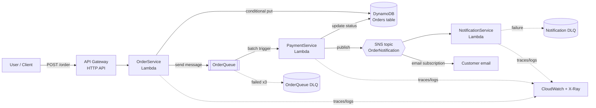

# Architecture

## Flow



A client posts an order. `OrderService` validates it, persists it, and hands
off to a queue so the HTTP request returns immediately. `PaymentService` picks
the order up asynchronously, settles payment, updates the order status, and
announces the result on SNS. `NotificationService` reacts to that announcement.

## Components

| Component | Service | Responsibility |
|---|---|---|
| [`OrderService`](../lambda_functions/order_service/app.py) | Lambda (Python 3.12) | Validate the request, write the order, enqueue it |
| `Orders` | DynamoDB | Order record and lifecycle status |
| `OrderQueue` | SQS | Decouples order intake from payment processing |
| [`PaymentService`](../lambda_functions/payment_service/app.py) | Lambda (Python 3.12) | Settle payment, transition status, publish result |
| `OrderNotification` | SNS | Fan-out point for anything that cares about a settled order |
| [`NotificationService`](../lambda_functions/notification_service/app.py) | Lambda (Python 3.12) | Dispatch customer notifications, record delivery |
| `OrderQueueDLQ` / `NotificationDLQ` | SQS | Capture messages that fail repeatedly |

## Order lifecycle

```
PLACED ──payment succeeds──▶ PAID
   │
   └────payment fails───────▶ PAYMENT_FAILED
```

`PaymentService` transitions the status with a `ConditionExpression` of
`status = PLACED`, so a duplicate SQS delivery cannot move an order that has
already settled.

## Data model

Table `Orders`, partition key `orderId` (String).

| Attribute | Type | Notes |
|---|---|---|
| `orderId` | String | Partition key. The client's `Idempotency-Key` when supplied, otherwise a UUID |
| `customerId` | String | Partition key of the `CustomerIndex` GSI |
| `items` | List | `[{ "sku": "...", "quantity": 1 }]` |
| `amount` | Number | Stored as `Decimal`; DynamoDB rejects native floats |
| `status` | String | `PLACED` / `PAID` / `PAYMENT_FAILED`. Partition key of the `StatusIndex` GSI |
| `createdAt` / `updatedAt` | Number | Unix epoch seconds |
| `notifiedAt` / `notificationStatus` | Number / String | Written by `NotificationService` |
| `ttl` | Number | Epoch seconds; DynamoDB expires the item automatically |

Two global secondary indexes exist because the access patterns need them:
`CustomerIndex` answers "every order for this customer" and `StatusIndex`
answers "every order currently stuck in `PLACED`" — neither is possible with a
partition-key-only table without a full scan.

## Design decisions

**Queue between order and payment.** The client should not wait on a payment
gateway. Putting SQS in between means the API responds in milliseconds, payment
retries are free, and a payment outage queues orders rather than dropping them.

**Idempotency at both ends.** `OrderService` writes with
`attribute_not_exists(orderId)`, so a client that retries with the same
`Idempotency-Key` gets one order rather than two. `PaymentService` guards its
status transition the same way, because SQS delivery is at-least-once by
design.

**Partial batch failure reporting.** `PaymentService` returns
`batchItemFailures` so one poisoned message does not send an entire batch of
ten back to the queue. This only works when the event source mapping has
`ReportBatchItemFailures` enabled — the code and the trigger configuration have
to agree.

**A separate notification function.** Emailing from inside `PaymentService`
would mean touching payment code to add SMS, Slack, or a templated SES email.
Subscribing a function to SNS keeps those concerns apart and gives each one its
own retry and DLQ behaviour.

**Least-privilege IAM per function.** Each Lambda gets its own execution role
scoped to the exact table, queue, and topic it touches, rather than one shared
role with broad permissions.

## Failure handling

| Failure | What happens |
|---|---|
| Malformed request body | `400` with a per-field list of validation errors |
| DynamoDB write fails | `500`, error logged as structured JSON, nothing enqueued |
| SQS send fails after the order is written | Request still returns `200`; the order sits in `PLACED` and is logged loudly for reconciliation |
| Payment raises | Only that message is returned as a batch item failure; retried up to 3 times, then parked in `OrderQueueDLQ` |
| Duplicate SQS delivery | Conditional update fails harmlessly and is logged as `status_already_updated` |
| Notification raises | Lambda retries the async invocation, then parks the event in `NotificationDLQ` |

A CloudWatch alarm on `OrderQueueDLQ` depth is the signal that messages are
dying permanently and need a human.
