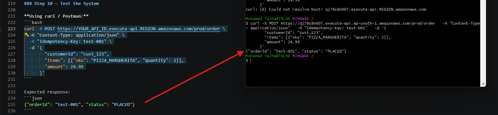
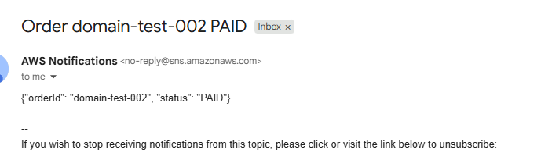

# Building It in the AWS Console

Ten steps from an empty account to a working endpoint. Doing this once makes it
obvious what the [SAM template](../../tree/iac-sam) is doing on your behalf —
after which you should never do it by hand again.

**Before you start**

- An AWS account with permission to create DynamoDB, SQS, SNS, Lambda, IAM, API
  Gateway and CloudWatch resources
- One region, picked now and kept throughout. Mixing regions is the single most
  common reason a step silently fails. This walkthrough uses **ap-south-1**
- The three handler files from [`lambda_functions/`](../lambda_functions), which
  you will paste into the console

**Order matters.** Each step produces an ARN or URL that a later step consumes,
so work top to bottom:

```
DynamoDB ─▶ SQS ─▶ SNS ─▶ IAM roles ─▶ OrderService ─▶ API Gateway
                                          └─▶ PaymentService ─▶ NotificationService ─▶ Alarms
```

---

## Step 1 — DynamoDB table

1. **DynamoDB → Tables → Create table**
2. Table name: `Orders`
3. Partition key: `orderId` (String)
4. Table settings: **Customize settings**
   - Read/write capacity: **On-demand**
   - Encryption: **AWS owned key** is fine for a demo
5. Under **Secondary indexes**, create two global secondary indexes:
   - `CustomerIndex` — partition key `customerId` (String)
   - `StatusIndex` — partition key `status` (String)
6. **Create table.** Once it reaches **Active**, open it and under
   **Additional settings** enable **Point-in-time recovery**, and **TTL** with
   the attribute name `ttl`

> The indexes are not decoration. `orderId` is the only key on the base table,
> so without `CustomerIndex` the question "show me this customer's orders" is a
> full table scan — fine over 2 rows, ruinous over 2 million.

## Step 2 — SQS queues

Create the dead letter queues first, so you can attach one while creating the
main queue.

1. **SQS → Create queue** → Type **Standard** → Name `OrderQueueDLQ` → **Create**
2. **Create queue** again → Type **Standard** → Name `NotificationDLQ` → **Create**
3. **Create queue** once more → Type **Standard** → Name `OrderQueue`
4. Under **Dead-letter queue**, enable it, choose `OrderQueueDLQ`, and set
   **Maximum receives** to `3`
5. Set **Visibility timeout** to `30` seconds
6. **Create queue**, then copy `OrderQueue`'s **URL** and **ARN**, and
   `NotificationDLQ`'s **ARN**

> Visibility timeout must exceed the consuming function's timeout. If Lambda can
> run for 10 seconds but the message becomes visible again after 5, SQS hands the
> same message to a second invocation while the first is still working — and you
> process the payment twice.

## Step 3 — SNS topic and subscription

1. **SNS → Topics → Create topic** → Type **Standard** → Name
   `OrderNotification` → **Create topic**
2. Copy the topic **ARN**
3. **Create subscription** → Protocol **Email** → your address → **Create**
4. Open the confirmation email from AWS and click the link

> Until you click it the subscription sits at `PendingConfirmation` and delivers
> nothing. This is the most common cause of "the pipeline works but no email
> arrives".

Create a second topic now for operational alerts — `OpsAlerts` — and subscribe
your email to it too. Alarms go here rather than to the customer-facing topic.

## Step 4 — IAM execution roles

One role per function. This is the step that decides whether Step 10 works, so
it is worth being precise rather than reaching for `AdministratorAccess`.

For each role: **IAM → Roles → Create role → AWS service → Lambda**, attach
`AWSLambdaBasicExecutionRole` (CloudWatch Logs) and `AWSXRayDaemonWriteAccess`
(tracing), then add an inline policy.

**`OrderService-role`**

```json
{
  "Version": "2012-10-17",
  "Statement": [
    {
      "Effect": "Allow",
      "Action": ["dynamodb:PutItem"],
      "Resource": "arn:aws:dynamodb:REGION:ACCOUNT_ID:table/Orders"
    },
    {
      "Effect": "Allow",
      "Action": ["sqs:SendMessage"],
      "Resource": "arn:aws:sqs:REGION:ACCOUNT_ID:OrderQueue"
    }
  ]
}
```

**`PaymentService-role`** — the one to get right. It touches three services, and
a missing action here does not fail at deploy time; it fails at runtime, three
retries later, in the dead letter queue.

```json
{
  "Version": "2012-10-17",
  "Statement": [
    {
      "Effect": "Allow",
      "Action": ["dynamodb:UpdateItem"],
      "Resource": "arn:aws:dynamodb:REGION:ACCOUNT_ID:table/Orders"
    },
    {
      "Effect": "Allow",
      "Action": [
        "sqs:ReceiveMessage",
        "sqs:DeleteMessage",
        "sqs:GetQueueAttributes"
      ],
      "Resource": "arn:aws:sqs:REGION:ACCOUNT_ID:OrderQueue"
    },
    {
      "Effect": "Allow",
      "Action": ["sns:Publish"],
      "Resource": "arn:aws:sns:REGION:ACCOUNT_ID:OrderNotification"
    }
  ]
}
```

**`NotificationService-role`**

```json
{
  "Version": "2012-10-17",
  "Statement": [
    {
      "Effect": "Allow",
      "Action": ["dynamodb:UpdateItem"],
      "Resource": "arn:aws:dynamodb:REGION:ACCOUNT_ID:table/Orders"
    },
    {
      "Effect": "Allow",
      "Action": ["sqs:SendMessage"],
      "Resource": "arn:aws:sqs:REGION:ACCOUNT_ID:NotificationDLQ"
    }
  ]
}
```

Replace `REGION` and `ACCOUNT_ID` throughout — your account ID is in the top
right of the console.

## Step 5 — OrderService Lambda

1. **Lambda → Create function → Author from scratch**
2. Name `OrderService`, Runtime **Python 3.12**
3. **Change default execution role → Use an existing role** → `OrderService-role`
4. Paste in [`lambda_functions/order_service/app.py`](../lambda_functions/order_service/app.py)
   and **Deploy**
5. **Configuration → Environment variables**:
   - `ORDERS_TABLE` = `Orders`
   - `ORDER_QUEUE_URL` = the queue URL from Step 2
6. **Configuration → General configuration → Edit** → **Timeout** `10` seconds
7. **Configuration → Monitoring and operations tools → Edit** → enable
   **Active tracing**

> The handler reads `ORDERS_TABLE` and `ORDER_QUEUE_URL` at import time, not
> per-request. Miss one and every invocation fails immediately with a `KeyError`
> before your code runs — which surfaces to the caller as a bare `500`.

## Step 6 — API Gateway HTTP API

1. **API Gateway → Create API → HTTP API → Build**
2. **Add integration → Lambda** → `OrderService`
3. API name: `OrderingHttpApi`
4. Route: **`POST`** `/order`
5. Stage: `prod`, auto-deploy on
6. **Create**, then copy the **Invoke URL** — your endpoint is that URL plus
   `/order`

**Before this faces anyone**, add a **JWT authorizer** (Cognito) or a **Lambda
authorizer** to the route, and set **throttling** under stage settings — 100
requests/second is a sane starting point. If a browser will call it directly,
configure **CORS** with your actual origin rather than `*`.

## Step 7 — PaymentService Lambda

1. **Lambda → Create function**, name `PaymentService`, Runtime **Python 3.12**,
   existing role `PaymentService-role`
2. Paste in [`lambda_functions/payment_service/app.py`](../lambda_functions/payment_service/app.py)
   and **Deploy**
3. Environment variables:
   - `ORDERS_TABLE` = `Orders`
   - `NOTIFICATION_TOPIC_ARN` = the topic ARN from Step 3
4. **General configuration** → **Timeout** `10` seconds — it must stay below the
   queue's 30-second visibility timeout
5. Enable **Active tracing**
6. **Add trigger → SQS** → `OrderQueue`
   - **Batch size** `10`
   - Tick **Report batch item failures**

> That checkbox matters more than it looks. The handler returns a
> `batchItemFailures` list, but unless the event source mapping is configured to
> expect it, AWS ignores the response entirely and retries all ten messages
> whenever any one of them fails.

## Step 8 — NotificationService Lambda

1. **Lambda → Create function**, name `NotificationService`, Runtime
   **Python 3.12**, existing role `NotificationService-role`
2. Paste in [`lambda_functions/notification_service/app.py`](../lambda_functions/notification_service/app.py)
   and **Deploy**
3. Environment variable: `ORDERS_TABLE` = `Orders`
4. Enable **Active tracing**
5. **Add trigger → SNS** → `OrderNotification`
6. **Configuration → Asynchronous invocation → Edit** → **Dead-letter queue** →
   `NotificationDLQ`

## Step 9 — Alarms

An alarm nobody receives is not monitoring, so give each one an action.

1. **CloudWatch → Alarms → Create alarm**
   - Metric: **Lambda → By Function Name → `PaymentService` → Errors**
   - Statistic **Sum**, period **5 minutes**, threshold **≥ 1**
   - Notification: send to the `OpsAlerts` topic from Step 3
2. Create a second alarm on **SQS → `OrderQueueDLQ` →
   `ApproximateNumberOfMessagesVisible`**, statistic **Maximum**, threshold
   **≥ 1**, same action. This is your "messages are dying permanently" signal
3. Repeat for `OrderService` **Errors** if you want intake covered too
4. **CloudWatch → Log groups**: confirm a group exists per function
5. Optional: **CloudWatch → Dashboards** → one row per function with
   Invocations, Errors, Duration and Throttles

## Step 10 — Test

```bash
curl -X POST https://YOUR_API_ID.execute-api.ap-south-1.amazonaws.com/prod/order \
  -H "Content-Type: application/json" \
  -H "Idempotency-Key: test-001" \
  -d '{
        "customerId": "cust_123",
        "items": [{"sku": "PIZZA_MARGHERITA", "quantity": 2}],
        "amount": 24.99
      }'
```

```json
{"orderId": "test-001", "status": "PLACED"}
```



Within a few seconds, with no further client involvement, the confirmation
arrives from the SNS subscription you set up in Step 3:



That email is the end-to-end proof: the queue was consumed, payment settled, the
order transitioned from `PLACED` to `PAID`, and SNS fanned the result out.

Then verify each hop — DynamoDB, SQS, the three log groups, your inbox — and
prove the two behaviours that separate this from a prototype: send the same
request twice and confirm one order results, then send a malformed body and
confirm you get a `400` rather than a `500`.

**[→ Full verification with screenshots](outputs.md)**

---

## Troubleshooting

| Symptom | Likely cause |
|---|---|
| `500` from the API, no application logs | An environment variable is missing; the handler fails at import |
| `403` from the API | Wrong path, or you called the stage root instead of `/order` |
| `404` from the API | The route is `POST /order` but you sent `GET`, or the stage is not deployed |
| Order stays `PLACED` | `PaymentService` is failing. Check its log group — an `AccessDeniedException` means Step 4's policy is short an action |
| Messages piling up in `OrderQueueDLQ` | Same cause. Three failed receives sends a message here permanently |
| Entire batches retrying | **Report batch item failures** is not ticked on the SQS trigger (Step 7) |
| The same order processed twice | Visibility timeout is shorter than the function timeout |
| No email | The SNS subscription is still `PendingConfirmation`, or nothing was published |
| `AccessDeniedException` in logs | The inline policy names the wrong region, account ID, or resource |

## Tearing it down

Built by hand means removed by hand, in this order: the SQS and SNS triggers,
the three functions, the HTTP API, both SNS topics and their subscriptions, the
three SQS queues, the `Orders` table, the CloudWatch alarms and log groups, and
the three IAM roles.

Fifteen resources, in dependency order, every time. On the
[`iac-sam`](../../tree/iac-sam) branch this is `sam delete` — which is the whole
argument for that branch.
