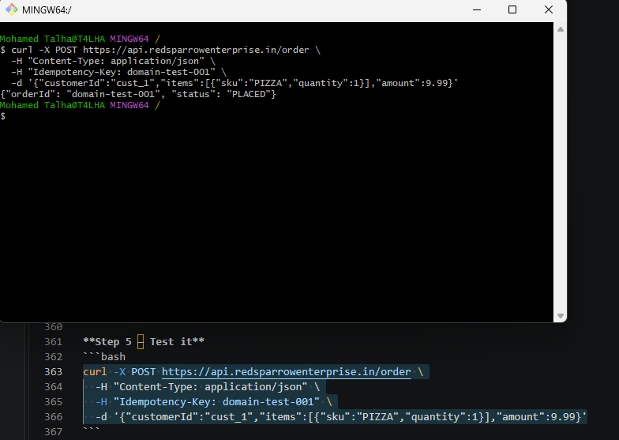

# Serving the API from a Custom Domain

Putting the API behind `api.redsparrowenterprise.in` instead of a generated
`execute-api` URL. Substitute your own domain throughout.

## How the pieces fit

```
Browser / client
   │  https://api.redsparrowenterprise.in/order
   ▼
Route 53  ── A/ALIAS record ──▶  API Gateway custom domain
                                 (terminates TLS with your ACM certificate)
                                        │
                                        ▼
                                 API mapping  ──▶  HTTP API, "prod" stage
                                        │
                                        ▼
                                 OrderService Lambda
```

Three things have to exist: a **custom domain name** in API Gateway holding the
certificate, an **API mapping** from that domain to your API and stage, and a
**DNS record** pointing at it. The template creates all three.

There is no port to set. API Gateway custom domains serve HTTPS on 443 and
nothing else — there is no plaintext port 80 to redirect from, unlike an ALB or
CloudFront distribution.

## Two prerequisites that catch people out

**The certificate must be in the same region as the stack.** For a *regional*
custom domain, ACM must have issued the certificate in the region you are
deploying to. The well-known "certificates must be in `us-east-1`" rule applies
to CloudFront and edge-optimized endpoints, not this. If yours is in the wrong
region, request a new one in the right region — DNS validation takes a few
minutes when you already control the domain.

**Route 53 must be authoritative for the domain.** Holding the certificate is
not enough; the hosted zone has to be the one actually answering DNS queries.
If you registered the domain elsewhere, delegate it by pointing your
registrar's `NS` records at the Route 53 hosted zone first.

## Gathering the three values

```bash
# Certificate ARN — run this in the region you are deploying to
aws acm list-certificates \
  --query "CertificateSummaryList[?contains(DomainName, 'redsparrowenterprise.in')]"

# Hosted zone ID (strip the /hostedzone/ prefix from the Id field)
aws route53 list-hosted-zones-by-name \
  --dns-name redsparrowenterprise.in \
  --query "HostedZones[0].[Id,Name]"
```

## Deploy with the domain

```bash
cd infrastructure
sam deploy \
  --parameter-overrides \
    ApiDomainName=api.redsparrowenterprise.in \
    AcmCertificateArn=arn:aws:acm:ap-south-1:ACCOUNT_ID:certificate/xxxxxxxx \
    HostedZoneId=Z0123456789ABCDEF
```

The `CustomDomainEndpoint` output prints `https://api.redsparrowenterprise.in/order`
once the stack settles. Alias records inside Route 53 resolve almost
immediately; allow a few minutes if you are testing from a network that caches
DNS aggressively.

### Creating the DNS record yourself

Omit `HostedZoneId` — for example when DNS lives in a different AWS account, or
with another provider. The stack still creates the domain and the mapping, and
the `RegionalDomainNameForDns` output gives you the alias target:

```bash
sam list stack-outputs --stack-name serverless-order-processing \
  --output json | grep RegionalDomainNameForDns
```

Point an `A`-record alias (or a `CNAME`, outside Route 53) at that
`d-xxxxxxxx.execute-api.REGION.amazonaws.com` value.

## Test

```bash
curl -X POST https://api.redsparrowenterprise.in/order \
  -H "Content-Type: application/json" \
  -H "Idempotency-Key: domain-test-001" \
  -d '{"customerId":"cust_1","items":[{"sku":"PIZZA","quantity":1}],"amount":9.99}'
```



The response is identical to the one from the generated `execute-api` URL, and
the path carries no `/prod` prefix. A few seconds later the confirmation email
arrives — see [outputs.md §3](outputs.md#3-end-to-end--placed-paid-confirmed)
for the full end-to-end trace.

## Troubleshooting

| Symptom | Likely cause |
|---|---|
| Stack fails creating `ApiCustomDomain` | The certificate is in a different region from the stack, or does not cover this hostname |
| Stack fails creating `ApiDnsRecord` | `HostedZoneId` is wrong, or belongs to a zone that is not authoritative for the domain |
| TLS/certificate error from `curl` | The certificate covers a different hostname than the one you called |
| `403 Forbidden` from API Gateway | The API mapping points at a stage that does not exist |
| `404 Not Found` | An `ApiMappingKey` was added, so the route is now `/<key>/order` |
| `NXDOMAIN` | DNS has not propagated, or the record went into a zone nobody queries |

> The equivalent console click-path is on the [`main`](../../tree/main) branch,
> in `docs/custom-domain.md`.
