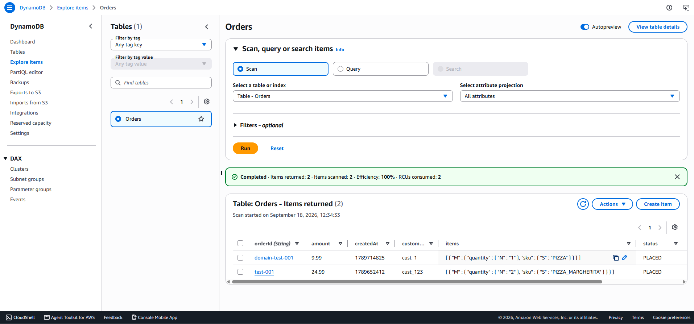
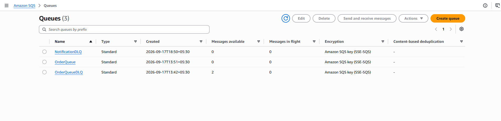
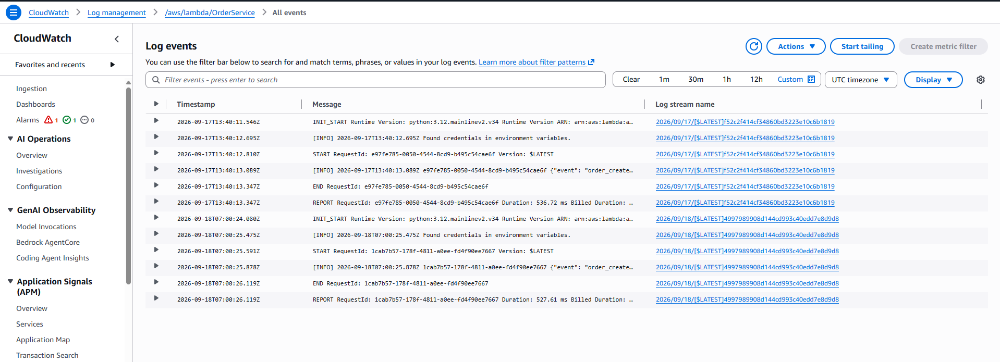
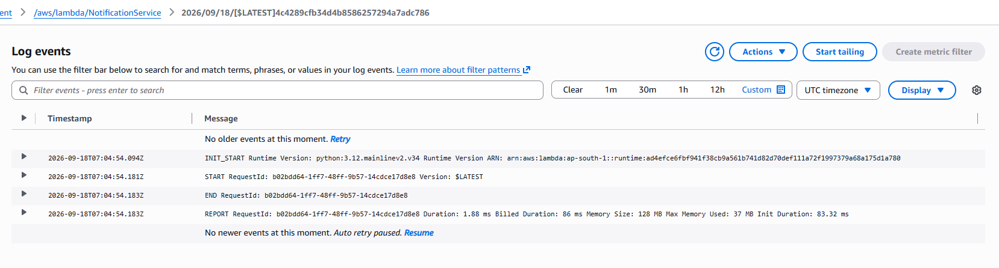
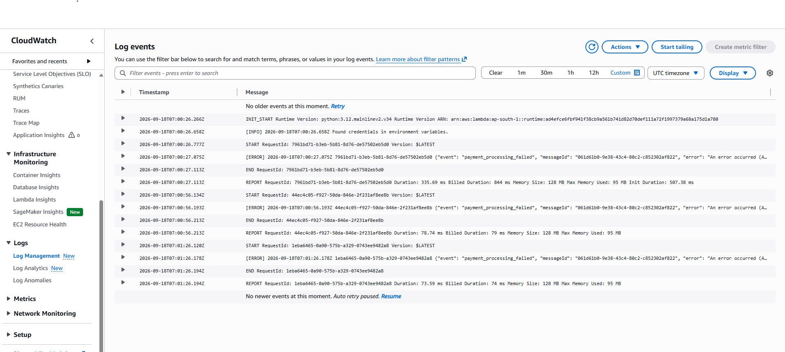
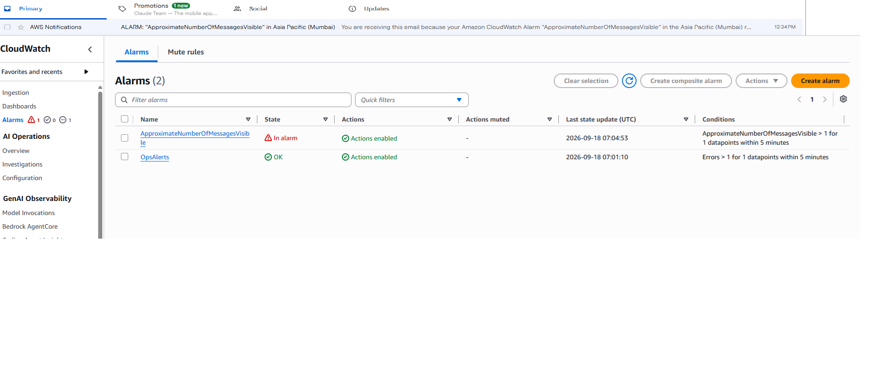

# Results and Output Analysis

Evidence from the live deployment in **ap-south-1**, following a request through
the system from `curl` to confirmation email. Each screenshot is followed by what
it actually proves.

> **A note on provenance.** These captures come from the console-built
> deployment on the [`main`](../../tree/main) branch. The architecture, the
> handler code and the resource names are identical to what this template
> produces, so the same verification applies after `sam deploy` — with one
> instructive difference, covered in section 8.

---

## 1. Placing an order

```bash
curl -X POST https://YOUR_API_ID.execute-api.ap-south-1.amazonaws.com/prod/order \
  -H "Content-Type: application/json" \
  -H "Idempotency-Key: test-001" \
  -d '{
        "customerId": "cust_123",
        "items": [{"sku": "PIZZA_MARGHERITA", "quantity": 2}],
        "amount": 24.99
      }'
```


```json
{"orderId": "test-001", "status": "PLACED"}
```

The endpoint comes from the stack's `ApiEndpoint` output:

```bash
sam list stack-outputs --stack-name serverless-order-processing
```

Three things worth reading out of this:

**The `orderId` is `test-001`, not a UUID.** That is the `Idempotency-Key` header
being honoured — `OrderService` uses the client's key as the primary key when one
is supplied, which is what makes a retry idempotent rather than duplicating the
order.

**The status is `PLACED`, not `PAID`.** By design. The response returns before
payment is attempted; settlement happens asynchronously off the queue, so the
customer is never waiting on a payment gateway.

**The failed attempt above it is instructive.** The first call errors with
`could not resolve host: qj78s8n007.execute-api.REGION.amazonaws.com` — the
literal string `REGION` was left in the URL. Copying the `ApiEndpoint` output
directly avoids that class of mistake entirely — a small argument for IaC in
itself: the template computes the URL rather than you transcribing it.

## 2. The same order through a custom domain

```bash
curl -X POST https://api.redsparrowenterprise.in/order \
  -H "Content-Type: application/json" \
  -H "Idempotency-Key: domain-test-001" \
  -d '{"customerId":"cust_1","items":[{"sku":"PIZZA","quantity":1}],"amount":9.99}'
```


Identical response shape from a branded hostname over TLS on 443. Note the path:
`https://api.redsparrowenterprise.in/order`, with no `/prod` stage prefix,
because `ApiDomainMapping` is declared without an `ApiMappingKey`. Three template
parameters produce all of it — see **[custom-domain.md](custom-domain.md)**.

## 3. End to end — placed, paid, confirmed

The whole point of the architecture in one screenshot. A third order,
`domain-test-002`:

```bash
curl -X POST https://api.redsparrowenterprise.in/order \
  -H "Content-Type: application/json" \
  -H "Idempotency-Key: domain-test-002" \
  -d '{"customerId":"cust_2","items":[{"sku":"CHICKEN_PIZZA","quantity":3}],"amount":29.99}'
```


The API returns immediately:

```json
{"orderId": "domain-test-002", "status": "PLACED"}
```

…and moments later, with no further client involvement, the confirmation
arrives:


> **Order domain-test-002 PAID**
> AWS Notifications `<no-reply@sns.amazonaws.com>`
> `{"orderId": "domain-test-002", "status": "PAID"}`

Read the two together and every asynchronous hop in the system is accounted for:

| What the screenshots show | What must have happened |
|---|---|
| `curl` returns `PLACED` in well under a second | `OrderService` validated the payload, wrote the order, and enqueued it — without waiting on payment |
| The email subject says `PAID` | `PaymentService` picked the message off `OrderQueue`, settled payment, and transitioned the order from `PLACED` to `PAID` |
| The email came from `sns.amazonaws.com` | `PaymentService` published to `OrderNotification`, and the confirmed email subscription delivered it |
| The subject line carries the order ID and status | The SNS `Subject` is built from the handler's own `f"Order {order_id} {status}"` |

The gap between the two — the response and the email — is the queue doing its
job. The customer's request was never blocked on any of it.

> The CloudWatch pane behind the terminal in the first image is scrolled to the
> **beginning** of the `PaymentService` log group (events at `07:00:26Z`), which
> is the earlier failing run described in section 8 — not this successful one.

## 4. The orders in DynamoDB



| `orderId` | `amount` | `customerId` | `items` | `status` |
|---|---|---|---|---|
| `domain-test-001` | 9.99 | `cust_1` | `[{ sku: PIZZA, quantity: 1 }]` | `PLACED` |
| `test-001` | 24.99 | `cust_123` | `[{ sku: PIZZA_MARGHERITA, quantity: 2 }]` | `PLACED` |

The schema detail is in the `items` column: `[{ "M": { "quantity": { "N": "1" },
"sku": { "S": "PIZZA" } } }]`. Order lines are stored as a **native list of
maps**, not a serialised JSON string, so a future query can filter on
`items[0].sku` without the application parsing anything. `amount` is stored as
`N` — the handler converts through `Decimal(str(...))` because DynamoDB rejects
Python floats outright.

Note the scan statistics: **2 items returned, 2 scanned, 100% efficiency, 2
RCUs**. Fine over two rows; over two million this is exactly the scan that
`CustomerIndex` and `StatusIndex` exist to avoid — both declared under
`GlobalSecondaryIndexes` in the template.

> This scan was taken **before** the fix in section 8, so it shows the two
> earlier orders still at `PLACED` and does not include `domain-test-002`.
> Re-scanning now returns three rows with `domain-test-002` at `PAID`.

## 5. The queue



| Queue | Messages available | Reading |
|---|---|---|
| `OrderQueue` | 0 | Messages were consumed — the trigger and receive permissions work |
| `OrderQueueDLQ` | **2** | The two orders from the failing run in section 8 were parked here after exhausting their retries |
| `NotificationDLQ` | 0 | Nothing failed on the notification side |

`OrderQueue` at zero with the DLQ at two is a precise signal: delivery worked,
processing did not. The redrive policy that put them there is four lines of the
template:

```yaml
RedrivePolicy:
  deadLetterTargetArn: !GetAtt OrderQueueDLQ.Arn
  maxReceiveCount: 3
```

All three queues show **Amazon SQS key (SSE-SQS)** — encryption at rest is on by
default and needs no configuration.

The two messages are still recoverable: SQS supports redriving a dead letter
queue back to its source, which would replay them against the now-corrected IAM
role.

## 6. OrderService logs



```
INIT_START Runtime Version: python:3.12.mainlinev2.v34
[INFO] Found credentials in environment variables.
START RequestId: 1cab7b57-…
[INFO] {"event": "order_created", …
END / REPORT  Duration: 527.61 ms
```

The `order_created` line is the structured JSON logging paying off — because
every log line is a JSON object with an `event` key, CloudWatch Logs Insights can
filter on `{ $.event = "order_created" }` instead of matching substrings against
free text.

`Found credentials in environment variables` is boto3 picking up the execution
role's temporary credentials — the role SAM generated from the function's
`Policies` block. No access keys exist anywhere in this project.

Both invocations show `INIT_START`, so both were cold starts at roughly 530 ms
including initialisation. Warm invocations of this handler run in single-digit
milliseconds.

## 7. NotificationService logs



```
START RequestId: b02bdd64-…
END   RequestId: b02bdd64-…
REPORT Duration: 1.88 ms  Billed: 86 ms  Memory: 128 MB  Max Memory Used: 37 MB
       Init Duration: 83.32 ms
```

This capture is from the failing period, and it is readable as such: **no
application log lines between START and END** — neither `notification_dispatched`
nor `notification_failed`. The handler loops over `event["Records"]`, so an
invocation that logs nothing received no records, which follows from section 8.
Once payment succeeded the same function logged `notification_dispatched` and
stamped `notifiedAt` on the order.

The numbers are still useful. **1.88 ms** executed against **86 ms billed** shows
Lambda's billing granularity plus init; **37 MB used of 128 MB** shows the `MemorySize`
set in the template's `Globals` has room to spare — worth knowing before tuning, since on Lambda memory and CPU are the
same dial.

## 8. When payment fails

Before the run in section 3, this system spent a period failing — and the
failure path is worth as much as the happy path, because it is the part most
projects never demonstrate.



```
07:00:27.075Z [ERROR] {"event": "payment_processing_failed",
                       "messageId": "061d61b0-9e38-43c4-80c2-c852302af822",
                       "error": "An error occurred (A…
07:00:56.193Z [ERROR] {"event": "payment_processing_failed",
                       "messageId": "061d61b0-9e38-43c4-80c2-c852302af822", …
07:01:26.178Z [ERROR] {"event": "payment_processing_failed",
                       "messageId": "061d61b0-9e38-43c4-80c2-c852302af822", …
```

Read the timestamps and the message ID together and the whole retry mechanism is
visible in three lines. **The same `messageId`**, failing at **07:00:27**,
**07:00:56** and **07:01:26** — almost exactly 30 seconds apart, which is the
queue's visibility timeout. Three receives against `maxReceiveCount: 3`, and the
message moves to `OrderQueueDLQ`. That is the DLQ depth of 2 in section 5.

**Root cause, and why this branch exists.** `An error occurred (…)` is a botocore
`ClientError`; the handler's outer `except Exception` caught it, logged it, and
returned the message as a batch item failure — correct behaviour throughout. The
underlying fault was an IAM gap in the **hand-written** `PaymentService-role`
from the console build. Adding the missing action produced the successful run in
section 3.

That specific failure cannot occur from this template. `PaymentService` declares
what it needs by reference:

```yaml
Policies:
  - DynamoDBCrudPolicy:
      TableName: !Ref OrdersTable
  - SNSPublishMessagePolicy:
      TopicName: !GetAtt NotificationTopic.TopicName
```

SAM expands those into scoped policies with ARNs derived from the resources
themselves. There is no region to mistype, no account ID to paste, and no action
to forget. This is the most concrete argument in the repository for
infrastructure as code over console clicks — and the screenshots above are what
the alternative costs. Background in
[production-readiness.md](production-readiness.md#least-privilege-and-what-it-costs-you).

### The alarm fired, and the email arrived



| Alarm | State | Condition |
|---|---|---|
| `ApproximateNumberOfMessagesVisible` | **In alarm** | `> 1 for 1 datapoints within 5 minutes` |
| `OpsAlerts` | OK | `Errors > 1 for 1 datapoints within 5 minutes` |

And in the inbox:

> **ALARM: "ApproximateNumberOfMessagesVisible" in Asia Pacific (Mumbai)**

End to end: a message failed, exhausted its retries, landed in the dead letter
queue, tripped a CloudWatch alarm, and put an email in front of a human — with
nobody watching a dashboard. Nothing was lost, and the failure was loud enough to
be found and fixed. In this template that entire chain is the
`OrderQueueDLQAlarm` resource and its `AlarmActions: [!Ref OpsAlertsTopic]`.

---

## What this proves

| Claim | Evidence |
|---|---|
| Intake is decoupled from settlement | §1, §3 — `PLACED` returns before payment is attempted |
| Idempotency keys are honoured | §1 — `orderId` is the supplied key, not a UUID |
| Custom domain terminates TLS correctly | §2, §3 |
| **The full pipeline works end to end** | **§3 — `PLACED` response, then a `PAID` confirmation email** |
| Payment transitions order status | §3 — the email body carries `"status": "PAID"` |
| SNS fan-out delivers to subscribers | §3 — email from `no-reply@sns.amazonaws.com` |
| Data persists with the intended schema | §4 — native list-of-maps, `Decimal` amounts |
| The queue trigger and permissions work | §5 — `OrderQueue` drained to 0 |
| Failures are retried, then contained | §8 — three receives 30s apart, then the DLQ |
| Failures are surfaced to a human | §8 — alarm in `ALARM`, email delivered |
| Generated IAM removes a whole class of bug | §8 — the root cause cannot occur from this template |
| Logs are machine-queryable | §6, §8 — structured JSON with an `event` key |

## Still to capture

Two screenshots would close the last gaps, both from the successful run:

- A fresh **DynamoDB scan** showing `domain-test-002` at `status = PAID`,
  replacing the pre-fix capture in section 4
- The **`PaymentService` log group filtered to `payment_processed`**, showing the
  successful counterpart to section 8

Neither changes what the system does — the confirmation email in section 3 is
proof that both happened — but both would make the evidence self-contained.
